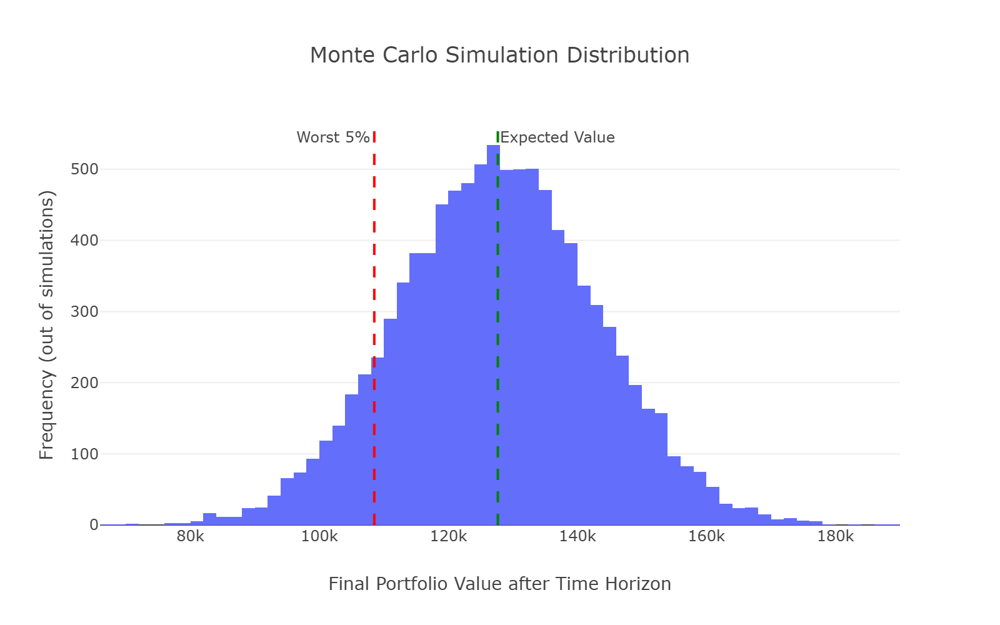
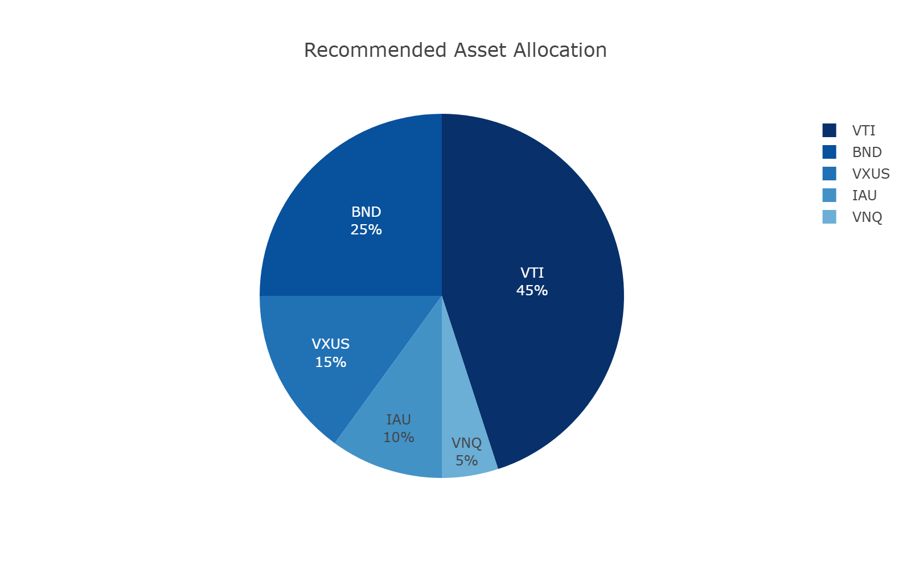
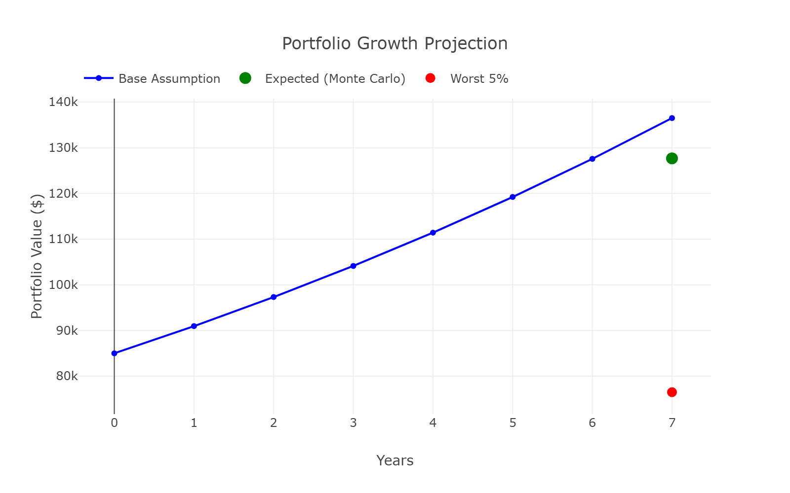

# MentalLoop Finance Advisor

**An intelligent multi-agent Personal Finance Advisor** built with **Mental Loop Architecture**, **LangGraph**, and real market data.

This project demonstrates advanced AI agent design for making smarter financial decisions through simulation, reflection, and iterative reasoning.

[![Watch the video]]<video src="examples/mental_loop_demo.mp4" controls width="640" height="360"></video>


(https://github.com/Hosein541/mental-loop-finance/main/examples/mental_loop_demo.mp4)

<video width="800" controls>
  <source src="https://raw.githubusercontent.com/[Hosein541]/[mental-loop-finance]/[main]/[examples/mental_loop_finance.mp4" type="video/mp4">
</video>
---

## ✨ Features

- **Mental Loop Architecture**: Agents think, simulate, evaluate risks, and refine decisions iteratively.
- **Real Market Data**: Monte Carlo simulations using real historical data from `yfinance`.
- **Multi-Agent System**:
  - Market Analyst
  - Fundamental News Analyst (using Tavily)
  - Risk Manager
  - Final Advisor
- **Interactive Chat**: Modify investment parameters naturally and trigger re-analysis.
- **Rich Visualizations**: Monte Carlo distribution, asset allocation, and growth projections.
- **Report Export**: Download full reports with embedded images.

---

## 🛠 Tech Stack

- **Framework**: LangGraph + LangChain
- **LLM**: Google Gemini (Gemini 3.1 Flash Lite)
- **Simulation**: yfinance + NumPy + Pandas
- **News Search**: Tavily
- **Frontend**: Streamlit
- **Visualization**: Plotly

---

## 🚀 Quick Start

### 1. Clone the Repository
```bash
git clone https://github.com/Hosein541/mental-loop-finance.git
cd mental-loop-finance
```

### 2. Install Dependencies
```bash
pip install poetry
poetry install --no-root
```
### 3. Run the Application
```bash
poetry run streamlit run app.py
```
### 4. API Keys
You need:

- Google Gemini API Key
- Tavily Search API Key


## 📸 Screenshots
Monte Carlo Simulation Distribution

Asset Allocation Pie Chart

Growth Projection


```bash
Project Structure
Bashmental-loop-finance/
├── app.py                    # Streamlit UI + Chat Interface
├── mental_loop_finance.py    # Main LangGraph + Agents
├── chat.py                   # Chat intent handling
├── visualization.py          # Plotly charts and image saving
├── images/                   # Generated visualization images
├── examples/                 # output examples for readme.me 
├── README.md
├── .gitignore
└── pyproject.toml
```

## How It Works

- User inputs financial profile (investment, time horizon, risk tolerance, etc.)
- Market Analyst proposes an investment strategy
- News Analyst fetches latest fundamental news
- Monte Carlo Simulator runs thousands of market scenarios
- Risk Manager evaluates risks and may request strategy revision
- Final Advisor delivers clear, actionable recommendation
- User can chat to modify parameters and instantly re-run analysis


## Future Enhancements

- Advanced Portfolio Optimization
- Multiple scenario comparison
- PDF report generation
- User history and saved scenarios
- Dark mode support


## License
This project is open-sourced under the MIT License.
